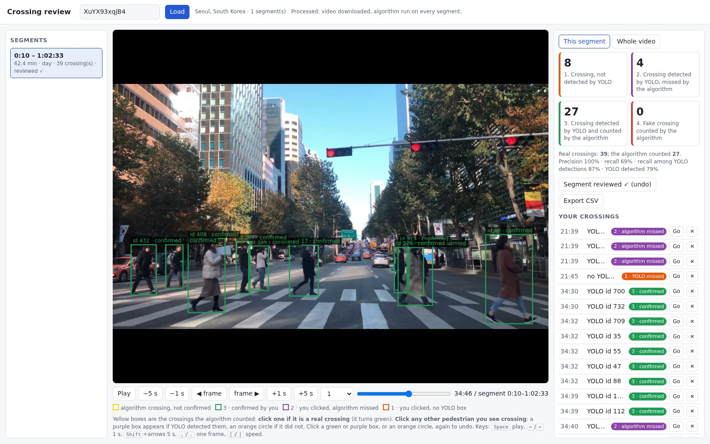

## CROWD-city

Analyses how pedestrians cross the road in dashcam footage from cities around the world (the [CROWD dataset](https://github.com/crowd-dataset/crowd)). For every city it counts road crossings and measures crossing speed in m/s and crossing initiation time (how long a pedestrian stands still before stepping onto the road), then relates them to city and country indicators.


*Cities in the current analysis (red dots) and the countries they are in.*

## Citation and usage of code
If you use this work for academic work please cite the following paper:

> Alam, M. S., Martens, M. H., & Bazilinskyy, P. (2025). 

The code is open-source and free to use. It is aimed for, but not limited to, academic research. We welcome forking of this repository, pull requests, and any contributions in the spirit of open science and open-source code. For inquiries about collaboration, you may contact Md Shadab Alam (md_shadab_alam@outlook.com) or Pavlo Bazilinskyy (pavlo.bazilinskyy@gmail.com).

## Getting started
[](https://www.python.org/downloads/release/python-31018/)
[](https://docs.astral.sh/uv/)

Tested with **Python 3.10.18** and the [`uv`](https://docs.astral.sh/uv/) package manager.
Follow these steps to set up the project.

**Step 1:** Install `uv`. `uv` is a fast Python package and environment manager. Install it using one of the following methods:

**macOS / Linux (bash/zsh):**
```bash
curl -LsSf https://astral.sh/uv/install.sh | sh
```

**Windows (PowerShell):**
```powershell
irm https://astral.sh/uv/install.ps1 | iex
```

**Alternative (if you already have Python and pip):**
```bash
pip install uv
```

**Step 2:** Fix permissions (if needed):

Sometimes `uv` needs to create a folder under `~/.local/share/uv/python` (macOS/Linux) or `%LOCALAPPDATA%\uv\python` (Windows).
If this folder was created by another tool (e.g. `sudo`), you may see an error like:
```lua
error: failed to create directory ... Permission denied (os error 13)
```

To fix it, ensure you own the directory:

### macOS / Linux
```bash
mkdir -p ~/.local/share/uv
chown -R "$(id -un)":"$(id -gn)" ~/.local/share/uv
chmod -R u+rwX ~/.local/share/uv
```

### Windows
```powershell
# Create directory if it doesn't exist
New-Item -ItemType Directory -Force "$env:LOCALAPPDATA\uv"

# Ensure you (the current user) own it
# (usually not needed, but if permissions are broken)
icacls "$env:LOCALAPPDATA\uv" /grant "$($env:UserName):(OI)(CI)F"
```

**Step 3:** After installing, verify:
```bash
uv --version
```

**Step 4:** Clone the repository:
```command line
git clone https://github.com/crowd-dataset/crowd-city
cd crowd-city
```

**Step 5:** Ensure correct Python version. If you don’t already have Python 3.10.18 installed, let `uv` fetch it:
```command line
uv python install 3.10.18
```
`pyproject.toml` pins `requires-python = "==3.10.18"`, so `uv` uses this version.

**Step 6:** Create and sync the virtual environment. This will create **.venv** in the project folder and install dependencies exactly as locked in **uv.lock**:
```command line
uv sync --frozen
```

**Step 7:** Activate the virtual environment:

**macOS / Linux (bash/zsh):**
```bash
source .venv/bin/activate
```

**Windows (PowerShell):**
```powershell
.\.venv\Scripts\Activate.ps1
```

**Windows (cmd.exe):**
```bat
.\.venv\Scripts\activate.bat
```

**Step 8:** Make sure the datasets are available: `mapping.csv` in the project root (or wherever `mapping` points), and the detection data in the directories set by `data` and `parquet_data` in `config`.


**Step 9:** Run the code:
```command line
python3 analysis.py
```

### Configuration of project
Configuration of the project is defined in `config`. Every value is read from `config`; `default.config` is only a template listing the settings that must exist. Its values are never used, so if `config` is missing any setting the run stops and names it. The config file has the following parameters (the segmentation settings are described in the next section):
- **`data`**: List of directories holding the YOLO detection output; the detection CSV files are read from their `bbox/` subfolder.
- **`parquet_data`**: List of directories holding the Parquet copy of the detections, one per entry in `data` and in the same order. The analysis reads detections only from here (`<root>/bbox/*.parquet`).
- **`sync_parquet_on_start`**: When `true`, new or changed CSV files under `data` are converted into the Parquet store before the analysis starts.
- **`videos`**: Directories containing the videos used to generate the data.
- **`mapping`**: CSV file with the city metadata and the list of videos and segments for each city.
- **`always_analyse`**: Always recompute the analysis, even when a matching `results.pickle` exists (useful for testing).
- **`waymo_dataset_path`**: Location of the raw Waymo Open Dataset used to calibrate the crossing detector and the metric speed model.
- **`process_waymo_if_missing`**: When `true`, the processed Waymo data is generated from `waymo_dataset_path` if it does not exist yet.
- **`min_max_videos`**: Number of fastest and slowest crossings for which video snippets are produced; `0` disables this.
- **`bbox_tracker`**: Tracker configuration file for YOLO tracking, used by `helper_script.py`.
- **`yolo_imgsz`**: Input size in pixels YOLO resizes each frame to when tracking the Waymo calibration videos (640). Each tracking CSV records the size it was made with, and changing this re-tracks the videos and rebuilds the speed model, since a speed model only fits tracks made with the same settings. 1280 finds more small, distant pedestrians, but its speed model failed the untouched validation test, so 640 is used.
- **`cpu_worker`**: Number of worker processes used to analyse detection files in parallel (also overridable with the `CROWD_CSV_WORKERS` environment variable).
- **`reanalyse_waiting_time`**: Recompute the crossing initiation time aggregates from the cached per-track values, for example after changing `min_waiting_time` or `max_waiting_time`.
- **`min_waiting_time`**: Minimum crossing initiation time, in seconds, for a crossing to be included.
- **`max_waiting_time`**: Maximum crossing initiation time, in seconds, for a crossing to be included.
- **`min_locality_population_percentage`**: A city is also kept when its population is at least this fraction of its country's population, even if it is below `population_threshold`.
- **`check_per_sec_time`**: Number of position checks per second used when measuring how long a pedestrian stands still before crossing. The checks are `round(fps / check_per_sec_time)` frames apart, and a check counts as standing still when the pedestrian moves no more than 10% of their box height. A wait needs at least three consecutive still checks, so the shortest recorded wait is about `3 / check_per_sec_time` seconds. Both the bounding-box and the road-surface initiation times are measured from the frames the checks actually span, so they stay in true seconds at any frame rate (at 40 fps a check is 13 frames, i.e. 0.325 s). A higher value lets slower walking pass as standing still, because the 10% limit applies to each check.
- **`analysis_level`**: Level at which results are reported: `city` or `country`.
- **`boundary_left`**: x-coordinate of one edge of the crossing area used to detect road crossings (normalised between 0 and 1).
- **`boundary_right`**: x-coordinate of the opposite edge of the crossing area used to detect road crossings (normalised between 0 and 1).
- **`population_threshold`**: Minimum city population for a city to be included in the analysis.
- **`footage_threshold`**: Minimum total footage, in seconds, for a city to be included in the analysis.
- **`min_crossing_detect`**: Minimum number of detected crossings for a country or city to be kept in the output; `0` disables this filter.
- **`reanalyse_speed`**: Recompute the crossing speeds from the cached per-track values, for example after changing `min_speed_limit` or `max_speed_limit`, or when the installed speed model reports a different unit from the cached results.
- **`min_speed_limit`**: Minimum crossing speed for a crossing to be included.
- **`max_speed_limit`**: Maximum crossing speed for a crossing to be included.
- **`countries_analyse`**: ISO3 codes of the countries to analyse; an empty list analyses all countries.
- **`cities_analyse`**: Cities to analyse; an empty list analyses all cities. City names repeat across countries and states, so each entry is `"City"`, `"City, ISO3"` or `"City, State, ISO3"`, for example `["Aberdeen, GBR", "Aberdeen, WA, USA", "Tokyo"]`. State and ISO3 are written as in `mapping.csv`, and names are matched case-insensitively against `locality` and `locality_aka`. A bare name keeps every city with that name and logs which ones matched. An entry that matches no city in `mapping.csv` stops the run. When `countries_analyse` is also set, a city must satisfy both lists, and `n_cities` then chooses among the cities that remain.
- **`n_cities`**: Number of cities to analyse, chosen by total footage: a positive value keeps the cities with the most footage, a negative value those with the least, and `null` keeps all cities.
- **`max_footage_hours_per_city`**: Caps the footage analysed per city, in hours; `null` analyses everything. Segments are drawn in a random order per city rather than in mapping order, so the budget is spread across that city's videos. Segments with no detection file in the Parquet store, or with a vehicle type outside `vehicles_analyse`, are skipped and the next segment is drawn in their place, so the whole budget goes to footage that is actually analysed. The last segment drawn is trimmed to fit the cap.
- **`footage_sampling_seed`**: Seed for that random draw (default `42`). The same seed always selects the same segments, so runs are reproducible; change it to analyse a different sample.
- **`target_crossings_per_city`**: Number of pedestrian crossings to collect per city, or `null` to switch this off (the default). When set, each city's footage is processed in the same seeded random order as `max_footage_hours_per_city`, one segment per city per round, and a city stops receiving footage once it has at least this many crossings (as counted by `crossing_rule`). Whole segments are processed, so a city can end slightly above the target; a city that runs out of footage keeps what it found. When `max_footage_hours_per_city` is also set, whichever limit is reached first applies. Footage time, object counts and every other statistic are then taken over exactly the footage processed. With `road_crossing`, the limit on unreadable segments applies to the whole run rather than to each round.
- **`processing_fps`**: Frame rate the detections are resampled to before analysis; `null` keeps each video's own frame rate.
- **`vehicles_analyse`**: Vehicle types (the codes in the mapping's `vehicle_type` column) to analyse; an empty list analyses footage from all vehicle types.
- **`min_confidence`**: Minimum YOLO detection confidence for a detection to be used.
- **`font_family`**: Font family used in the figures.
- **`font_size`**: Font size used in the figures.
- **`plotly_template`**: Plotly template used for the figures.
- **`logger_level`**: Level of console output: `debug`, `info`, `warning` or `error`.
- **`ftp_base_url`**: Base URL of the file server that hosts the videos. Used by the segmentation pass, the segmentation sample renderer and the crossing validation tool.
- **`display_frame_tracking`**: Read by `helper_script.py` but currently has no effect.
- **`save_annoted_img`**: Read by `helper_script.py` but currently has no effect.
- **`save_tracked_img`**: Read by `helper_script.py` but currently has no effect.
- **`delete_labels`**: Read by `helper_script.py` but currently has no effect.
- **`delete_frames`**: Read by `helper_script.py` but currently has no effect.
- **`save_images`**: Whether to export PNG and EPS alongside the interactive HTML. Raster export goes through kaleido, which launches a headless Chromium and is prone to hanging indefinitely on Windows. Set this to `false` to keep only the HTML, which carries the same data, when a run stalls on "Saving png file for ...".

### Choosing which cities to analyse
The analysis runs on every city in `mapping.csv` unless you narrow it down. The settings take effect in this order:

1. `countries_analyse` keeps only the listed countries (ISO3 codes).
2. `cities_analyse` keeps only the listed cities.
3. `n_cities` keeps the cities with the most footage (or the least, if negative) out of those that remain.
4. `max_footage_hours_per_city` and `target_crossings_per_city` limit how much of each remaining city's footage is processed.
5. After the detections are analysed, `population_threshold`, `min_locality_population_percentage` and `footage_threshold` drop small cities and cities with little footage from the reported results.

City names are not unique: `mapping.csv` has, for example, an Aberdeen in Great Britain and two in the United States. Each `cities_analyse` entry can therefore name the country, and the state too when a country has several cities with that name:

```json
"countries_analyse": [],
"cities_analyse": [
  "Aberdeen, GBR",
  "Aberdeen, WA, USA",
  "Tokyo"
],
```

- `"City, ISO3"` picks the city in one country, and `"City, State, ISO3"` picks one within a country. Write state and ISO3 exactly as in the `state` and `iso3` columns of `mapping.csv`.
- A bare `"City"` keeps every city with that name. The log then lists the cities it matched, so you can narrow the entry down if that was not intended.
- Case is ignored, and alternative names in `locality_aka` are matched too, so `"Aliabad-e Katul"` finds Ali Abad in Iran.
- An entry that matches no city in `mapping.csv`, such as a misspelling, stops the run at the start with an error naming it, instead of silently analysing nothing. A listed city that the thresholds in step 5 later remove is only noted in the log.
- Leave both lists empty (`[]`) to analyse all cities.

Changing either list changes which results are valid, so the next run reanalyses instead of reusing `results.pickle`. With `always_analyse` set to `false`, a rerun with unchanged settings reuses `results.pickle` and goes straight to the figures.

### Road-surface segmentation
Crossing speed and crossing initiation time can additionally be measured against the road surface rather than from bounding-box motion alone. When enabled, the analysis segments only the video windows that contain an already-detected crossing with SegFormer finetuned on Cityscapes, reads the surface under each pedestrian's feet, and derives the interval that pedestrian actually spends on the carriageway. The initiation time then becomes the stationary interval immediately before stepping onto the road, and the speed is fitted over the on-road frames only.

The mapping output keeps both derivations side by side: `speed_crossing_bbox_*` and `time_crossing_bbox_*` always hold the bounding-box values, `speed_crossing_seg_*` and `time_crossing_seg_*` always hold the segmentation values, and `speed_crossing_*` and `time_crossing_*` hold whichever one `segmentation_is_primary` selects for reporting, which is what every figure reads. Note that the frozen Waymo speed model was calibrated on whole algorithm-selected tracks, so restricting its input window moves it away from the distribution it was validated on; the count of tracks rejected as `out_of_calibration_distribution` is logged for exactly this reason.

Nothing needs a surface label for every frame. The crossing speed is measured between road entry and road exit, and the initiation time is the wait ending at road entry, so only those two moments have to be located. A pedestrian who steps onto the road without first standing still for at least three position checks (see `check_per_sec_time`) has no initiation time and is left out of the averages rather than counted as zero, as in the bounding-box metric; so is one who is already on the road when first seen. A coarse pass therefore establishes the shape of each track, and a finer pass looks only inside the spans that must contain a change. Tracks crossing at the same moment share the decoded frames, and a track already on the carriageway throughout costs nothing beyond the coarse pass.

Video is never downloaded in full: ffmpeg seeks over HTTP range requests and decodes only the crossing windows. Only the derived per-frame surface labels are cached, keyed by a fingerprint of the crossing configuration, so re-tuning the crossing detector correctly invalidates the store rather than reusing labels sampled for a different set of tracks.

**What it looks like.** Each sample below shows the road (red) and footpath (green) found by the segmentation model, and a box on each pedestrian counted as crossing. For these images the boxes were also labelled with each pedestrian's road-restricted speed and initiation time. `speed: n/a` means the speed model's reliability gates rejected that track; `wait unseen` means the pedestrian was already on the road when first seen.


*Correctly counted crossings: a zebra crossing in Catania (1.39 m/s, no wait), a signalised crossing in Birmingham, a pedestrian waiting 2.56 s at the kerb in Prague at night, and a crossing in front of a shop in the United States.*

To render sample clips from your own run, with the surface overlay and the boxes labelled by track id (the clips are written to `_output/segmentation_samples/`):

```bash
uv run python visualize_segmentation_samples.py --samples 8
```

- **`crossing_rule`**: Decides which pedestrians count as crossing, for every count, speed, waiting time and figure. `detector` uses the CROWD crossing detector alone: the track must pass through the vertical strip between `boundary_left` and `boundary_right` and survive its motion filters. `road_crossing` uses the road surface instead, and is tuned for precision first: whenever it counts a crossing, that should really be a pedestrian walking across the road in front of the camera. Broken YOLO tracks of sideways-walking pedestrians are first joined (`utils/crossing/track_joining.py`); a pedestrian then counts only when the track passes the centre of the image (in front of the camera) or, first seen inside the centre strip, walks out of it steadily (at least 0.3 m/s, without slowing to under a quarter of its starting speed), is not a cyclist or rider, moves independently of the camera (both relative to static objects and, from the picture itself, relative to the background when the car turns), is not a small distant figure moving at a rider's speed, can be verified when the camera moves (see below), has its feet on the road while moving across at least `min_crossing_x_range` of the image with a slowly changing box size (which rejects people walking along the road), and walks at a plausible pace that does not speed up sharply. On every reviewed test, Waymo and hand-checked CROWD footage, its precision is 100%, at a recall of about a third (see [Manual verification of crossings](#manual-verification-of-crossings)). It requires `use_segmentation` and the video file server: candidates are first found from the boxes alone, then segmented, and the run stops if the road surface cannot be read for more than 5% of segments rather than undercounting crossings. The rules are defined in `utils/crossing/road_crossing.py`.
- **`use_segmentation`**: Enables the road-surface segmentation pass. When disabled, the analysis is exactly the baseline. Required when `crossing_rule` is `road_crossing`.
- **`segmentation_is_primary`**: Determines which derivation the figures report. When `false` every figure and correlation uses the bounding-box metrics. When `true` the segmentation values become the reported crossing speed and initiation time throughout, i.e. in `speed_crossing_*` and `time_crossing_*`. Either way the bounding-box values stay in `speed_crossing_bbox_*` / `time_crossing_bbox_*` and the segmentation values in `speed_crossing_seg_*` / `time_crossing_seg_*`, so the two can always be compared. Note that the segmentation metrics do not cover every crossing the baseline covers: a track is dropped when it never reaches the carriageway, when the frozen speed model's reliability gates reject the shortened window, and, for the initiation time, whenever the pedestrian was already on the road when first detected. The count of localities that lose a value is logged when this is enabled.
- **`seg_data`**: Directory holding the persistent surface-label store.
- **`segmentation_model`**: Hugging Face identifier of the SegFormer Cityscapes checkpoint. Any `nvidia/segformer-b*-finetuned-cityscapes` checkpoint works; `b4` and `b5` are more accurate and slower, `b0` is the escape hatch when throughput rather than accuracy is the binding constraint. Segmentation is the dominant cost of this pass, so run it on a CUDA device.
- **`segmentation_device`**: Torch device for segmentation; `auto` prefers CUDA, then MPS, then CPU.
- **`segmentation_parallel_videos`**: Number of detection segments whose video windows are read from the file server at once. Reading is almost entirely waiting on the server, so a few in parallel cut the run time roughly proportionally, while the GPU model still runs one batch at a time. Failed reads (the server returns transient 5XX errors under load) are retried three times with growing pauses, and a segment that still cannot be read counts as failed rather than being stored with missing frames. Keep this modest (about 3), since the server struggles under many concurrent requests.
- **`segmentation_batch_size`**: Number of frames passed through the model at once.
- **`segmentation_coarse_hz`**: Sampling rate of the first pass, which only has to establish the shape of each track: off the carriageway, then on it, then off it again.
- **`segmentation_refine_hz`**: Sampling rate of the second pass, which looks only inside the short spans where a transition must lie. This sets how precisely the start of the crossing is located, and therefore the resolution of the initiation time.
- **`segmentation_input_width`** / **`segmentation_input_height`**: Resolution frames are scaled to before segmentation.
- **`segmentation_min_confidence`**: Minimum per-pixel confidence for a pixel to contribute to the surface decision.

The file server credentials (`ftp_username`, `ftp_password`, `ftp_token`) in `secret` are required for this pass, because the crossing windows are read from the server.

For working with external APIs of [VideoFiles](https://files.mobility-squad.com/), [GeoNames](https://www.geonames.org), [BEA](https://apps.bea.gov/api/signup), [TomTom](https://developer.tomtom.com/user/register), [Trafikab](https://www.trafiklab.se/api/trafiklab-apis), and [Numbeo](https://www.numbeo.com/common/api.jsp) (paid), the API keys need to be placed in file `secret` (no extension) in the root of the project. The file needs to be formatted as `default.secret`. These keys are optional for just running the analysis on the dataset, except for the file server credentials needed by the segmentation pass.


### Manual verification of crossings
Every crossing the pipeline counts feeds the city averages, so the crossing algorithm is held to **100% precision**: whenever it counts a pedestrian as crossing, that pedestrian must really be crossing. Recall (how many of the real crossings it finds) is secondary. Precision is not estimated from labels of another dataset but checked by hand, by watching the footage.

**What counts as a crossing.** A pedestrian who walks across the road *in front of the camera*, from one side to the other (or who steps out in front of the camera and walks to one side). Feet on the road alone, walking along the road, crossing a side street, cyclists and other riders do not count.

#### The review set
The test uses a fixed set of daytime videos filmed from a car, about one hour each, listed with their video ids in [`crossing_review_set.json`](crossing_review_set.json): Los Angeles, Amsterdam, Seoul, Sydney and Cairo, chosen before they were reviewed and never used to tune the rule, and Paris, a busy video whose first 12 minutes were used while tuning. The ids are fixed so that every change to the rule is judged on the same footage. A video is only usable when its YOLO detection file covers the whole video; two first choices were replaced for that reason (Sydney `JMUROQ59kAQ`, whose file holds only the first second, and Amsterdam `iVJGEW1st8c`, whose file covers only its last 13 minutes).

#### The review tool
`crossing_review.py` (with its page `crossing_review.html`) is a small local web tool for this. Start it and open the address it prints (`--port` changes the port, 8770 by default; `--no-browser` stops it opening a browser):

```bash
uv run python crossing_review.py
```


*The review tool on the Seoul video at a busy signalised crossing (34:46). Green boxes are crossings the algorithm counted and the reviewer confirmed; the four counts, precision and recall are on the right, above the list of the reviewer's clicks, each with a **Go** button that jumps to it.*

1. **Process the video.** Enter a video id and press **Process video**. This does all the slow work once, before you start, so the review has no lag: the whole video is downloaded (over 8 parallel connections) into `_output/crossing_review/videos/`, the segment's YOLO detection file is read (files missing locally are fetched from the file server's `data` alias, see `--csv-url-path`, and converted to Parquet), and the crossing algorithm (the detection worker, then `crossing_rule` with the current `config`) runs on every segment, reading the local video. An hour of video takes roughly 10 to 30 minutes, mostly the download. The result is cached in `_output/crossing_review/segments/` together with the rule version, so it is redone automatically when the rule changes.
2. **Watch the whole segment.** The video plays from the local copy. Every crossing the algorithm counted is drawn as a **yellow** box while it happens. No other boxes are drawn, so the review is not steered by what YOLO saw.
3. **Mark what you see:**
   - **Click a yellow box if it is a real crossing**; it turns **green**.
   - **Click every other pedestrian you see crossing.** If YOLO detected them, a **purple** box appears around them; if not, an **orange** circle marks the spot.
   - Click a green or purple box, or an orange circle, again to undo.
4. **Check the leftovers and finish.** Yellow boxes you have not confirmed are listed with a **Go** button that jumps to each, so every one is looked at before finishing. Then mark the segment fully reviewed.

The page keeps four counts as you go:

| | Category | On screen |
|---|---|---|
| 1 | Crossing, not detected by YOLO | orange circles |
| 2 | Crossing detected by YOLO, missed by the algorithm | purple boxes |
| 3 | Crossing detected by YOLO and counted by the algorithm | green boxes |
| 4 | Fake crossing: counted by the algorithm, not a crossing | yellow boxes left unconfirmed |

From these it shows **precision** = 3 / (3 + 4), **recall** = 3 / (1 + 2 + 3) and the share of crossers YOLO detected = (2 + 3) / (1 + 2 + 3), per segment or for the whole video. Labels are saved after every click in `_output/crossing_review/labels/<video_id>.json` (each click with its time, position and YOLO track id), so a review can be stopped and resumed, and **Export CSV** writes the counts per segment. The file-server credentials come from the secrets file and never reach the browser.

#### How the test is used
- The review set is the **held-out test**: thresholds are tuned on Waymo and on the reviewed Paris minutes, never on these videos.
- Any fake crossing found in the set is shown, as a clip, to the reviewer before anything is changed; a fix is only adopted if it keeps every earlier review at 100% precision.
- A change that adds crossings is checked against all reviewed data first (Waymo, Paris and every reviewed video), and the pedestrians it adds that no review has seen yet are reviewed as clips before it is adopted.

#### Results
| City | Video id | YouTube URL | Footage | Counted by the algorithm | Real (confirmed) | Fake | Precision | Missed by the algorithm (YOLO detected) | Not detected by YOLO | Recall |
|---|---|---|---|---|---|---|---|---|---|---|
| Los Angeles | `1LS7MhOyhro` | <https://www.youtube.com/watch?v=1LS7MhOyhro> | 60.0 min from 0 s | 6 | 6 | 0 | **100%** | 6 | 3 | 6 / 15 (40%) |
| Amsterdam | `1xvhW53j75A` | <https://www.youtube.com/watch?v=1xvhW53j75A> | 58.8 min from 0 s | 7 | 7 | 0 | **100%** | 6 | 4 | 7 / 17 (41%) |
| Seoul | `XuYX93xqjB4` | <https://www.youtube.com/watch?v=XuYX93xqjB4&t=10s> | 62.4 min from 10 s | 27 | 27 | 0 | **100%** | 4 | 8 | 27 / 39 (69%) |
| Sydney | `u084OpLn2Ps` | <https://www.youtube.com/watch?v=u084OpLn2Ps&t=38s> | 59.7 min from 38 s | 3 | 3 | 0 | **100%** | 6 | 1 | 3 / 10 (30%) |
| Cairo | `Esyp2P0uJu4` | <https://www.youtube.com/watch?v=Esyp2P0uJu4&t=36s> | 96.2 min from 36 s | 85 | 85 | 0 | **100%** | 125 | 16 | 85 / 226 (38%) |
| Paris | `AdqE7mFQ7Y4` | <https://www.youtube.com/watch?v=AdqE7mFQ7Y4&t=31s> | 37.0 min from 31 s | 116 | 116 | 0 | **100%** | 85 | 47 | 116 / 248 (47%) |

In Los Angeles, YOLO detected 12 of the 15 pedestrians who crossed, and the algorithm counts 6 of those 12. In Amsterdam, YOLO detected 13 of the 17, and the algorithm counts 7 of those 13. In Seoul, YOLO detected 31 of the 39, and the algorithm counted 27 of those 31; most crossed in two busy minutes at a signalised crossing (34:28-35:03 and 41:36-42:00), and 2 of the 27 are pedestrians who emerge in front of the camera, the first held-out test of that part of the rule. In Sydney, YOLO detected 9 of the 10, and the algorithm counts 3 of those 9. In Paris, a busy city centre, YOLO detected 201 of the 248, and the algorithm counts 116 of those 201; three more it used to count were pedestrians standing on the pavement while the car turned (see below). In Cairo, a busy video with the car moving in dense traffic, YOLO detected 210 of the 226, and the algorithm counts 85 of those 210; at one stage it counted 101, of which 9 were not crossings (see below). The first Cairo video chosen (`a4zcL56YSME`) was replaced by a longer, busier one because the algorithm counted no crossing in its 73 minutes, so it could not test precision.

The rule was tuned on other data, which is reported separately:

| Data | Counted | Fake | Precision | Recall |
|---|---|---|---|---|
| Waymo training (798 recordings; tuning) | 241 | 0 | 100% | 167 / 416 crosswalk crossers (40%) |
| Waymo validation (202 recordings; held out until the emerging limits, see below) | 43 | 0 | 100% | 26 / 79 crosswalk crossers (33%) |

On Waymo, a counted pedestrian is real when Waymo labels them as crossing on a crosswalk or, since those labels cover marked crosswalks only, when a hand review of the clip confirms a crossing elsewhere (71 in training, 17 in validation).

**Counting pedestrians who emerge in front of the camera.** Of the 7 Los Angeles crossers YOLO detected but the first version of the rule missed, 1 is a distant figure (box 0.07 of the image high) seen for under 2 s near the centre, 3 are only tracked on one side of the centre, so they never pass in front of the camera within their track, 1 fails both the box-size and the camera-motion checks, and 2 are first seen inside the centre strip and walk out to the left, i.e. they step out from behind something in front of the camera. Allowing such pedestrians added 32 real crossings on Waymo training, 6 on validation, 3 on the reviewed Paris segment and 1 in Los Angeles, but also 2 fakes, confirmed by hand: a Waymo pedestrian who nearly stops (the speed over the last third of the track is 0.15 of that over the first third; every real one at least 0.38) and a Paris pedestrian creeping at 0.23 m/s (the slowest real one 0.33 m/s). These pedestrians therefore also have to walk at least 0.3 m/s and must not slow to under a quarter of their starting speed (`EMERGING_MINIMUM_WALKING_SPEED`, `EMERGING_MINIMUM_SPEED_UP` in `utils/crossing/road_crossing.py`), which keeps every added real crossing and removes both fakes. Because these two limits were set on the data above, Amsterdam, Seoul, Sydney and Cairo are the independent test of them; pedestrians who pass the centre are judged exactly as before.

**Pedestrians swept across by a turning car.** Reviewing the whole Paris video found 3 counted pedestrians who were not crossing: two people standing on the pavement while the car turned right at a junction, carried across the image by the turn, and a distant figure who stepped out of the centre strip and then sped up almost five times. The box-only camera-motion check could not catch the first two, because no static object was tracked in the same frames. The pipeline now also measures the camera's turn from the picture itself: for every pedestrian who passes all other checks it reads the window from the video at 5 frames per second and sums the sideways shift of the upper half of the image between frames (phase correlation, `utils/segmentation/camera_shift.py`). When the background slides at least 0.1 of the image width, the pedestrian must move relative to the background by at least 0.27 of that slide (`TURN_MINIMUM_BACKGROUND_SHIFT`, `TURN_MINIMUM_RELATIVE_SHARE`). Of 434 hand-confirmed crossings (282 on Waymo, 152 on the reviewed CROWD videos), 40 were made while the camera turned, all with a share of at least 0.31; the two swept pedestrians had 0.04 and 0.23. Pedestrians who emerge in front of the camera may also speed up at most 4 times (`EMERGING_MAXIMUM_SPEED_UP`): the distant figure and the earlier Paris fake both sped up 4.8 times, every confirmed emerging crosser at most 3.7 times. With both checks the 3 Paris fakes are gone, and every crossing counted on Waymo and on the other reviewed videos is unchanged.

**Fakes in dense, moving traffic (Cairo).** The busy Cairo video, filmed while the car moves through dense traffic, had 9 counted pedestrians that were not crossing: 2 distant motorcyclists whose motorcycle YOLO detected in only 2 and 5 frames, 2 tracks where YOLO's tracker drifted from a distant person to a nearby one under the same id, people walking towards the camera, and a runner while the car turned. None of the measures so far separates them from real crossings on its own, and neither did comparing the colours inside the box (which change for real crossers too) or a feature-point camera-motion measure. Two checks remove all 9 (in `utils/crossing/road_crossing.py`):

- **Distant rider:** a box below 0.085 of the image height moving faster than 1.8 m/s (`DISTANT_RIDER_*`) is a rider, not a pedestrian.
- **Unverifiable crossing:** when the camera moves (the background slides more than 0.05 of the image width), no static object is tracked in the same frames to show the pedestrian moving on their own, and the box grows more than 1.4 times from the first to the last third of the track or moves faster than 3 m/s (`UNVERIFIED_*`), the crossing is not counted.

The cost is recall: of the 526 hand-confirmed crossings (282 on Waymo, 244 on the reviewed CROWD videos), 28 are no longer counted, 18 of them in Cairo and 10 on Waymo, and none on Los Angeles, Amsterdam, Seoul, Sydney or Paris. A blanket rule (not counting any unverifiable crossing while the camera moves) would have lost 47. The limits were set on these same fakes, so a newly reviewed video is their test. Recovering the remaining real crossings without fakes would need better tracks upstream, mainly a tracker that re-identifies people so that one track does not switch between them.

**Raising recall again.** Tracing every crosser YOLO detected but the rule missed showed two limits that rejected real crossings and nothing else: the box-size change limit (people crossing right in front of an approaching car, whose box grows fast) and the speed-up limit (people who wait at the kerb, then cross). Raising them from 0.25 to 0.35 (`MAXIMUM_BOX_SIZE_CHANGE_RATE`) and from 5 to 9 (`MAXIMUM_SPEED_UP`) adds 15 real crossings on the reviewed videos and 12 on Waymo training, with no fake; 9 stays below the 9.8 of a Waymo pick the review had marked as not crossing. Segmentation frames are also sampled on a fixed grid of video time, so a pedestrian's road labels no longer depend on which other pedestrians are segmented at the same time; before, adding a candidate could shift the frames of its neighbours and tip a borderline crossing over a threshold.

### Waymo calibration: current results and what was tried
Crossing speeds are reported in m/s by a speed model calibrated on the [Waymo Open Dataset](https://waymo.com/open/), whose lidar-derived pedestrian speeds serve as the reference. The analysis refuses to run without a qualified model rather than falling back to a relative index. When `process_waymo_if_missing` is enabled, the raw Waymo TFRecords are exported (in Docker if available, otherwise in a local `uv` environment), tracked with YOLO and BoT-SORT at `yolo_imgsz`, and the speed model is fitted on the Waymo training split and tested once on the untouched validation split. The model is only used when it passes both the cross-validation and the external validation checks.

**Current result** (640 px tracking, speed model trained on the CROWD detector's crossings):

| | Tracks | MAE | RMSE | Bias | Within 0.50 m/s |
|---|---|---|---|---|---|
| Development, source-grouped cross-validation | 166 | 0.19 m/s | 0.26 m/s | −0.02 m/s | 95.18% |
| Untouched validation | 27 | 0.13 m/s | 0.21 m/s | −0.05 m/s | 96.30% |

City averages are close to unbiased; individual crossings are typically off by 0.1–0.2 m/s, and estimates are compressed towards the mean (slow walkers read too fast, fast walkers too slow), so differences between cities are understated but their order is kept. With 27 validation tracks the validation MAE carries an uncertainty of about ±0.03–0.04 m/s.


*Estimated crossing speed against Waymo's lidar-derived reference speed, for the training fit, the source-held-out cross-validation and the untouched validation set. Points on the dashed line are exact.*

**Crossing detection**, scored against Waymo's crosswalk-crossing labels (which cover marked crosswalks only, so precision is a lower bound; hand audits found about half of the "wrong" picks to be real crossings elsewhere):

| Rule | Recall, training | Recall, validation | Precision (lower bound) |
|---|---|---|---|
| CROWD detector | 139 / 918 (15%) | 19 / 183 (10%) | 65% / 58% |
| Detector with feet on the road | 139 / 918 (15%) | 19 / 183 (10%) | 70% / 59% |
| `road_crossing`, first version (feet on the road only) | 232 / 918 (25%) | 51 / 183 (28%) | 49% / 49% |

These were the first comparisons. The `road_crossing` rule used now adds the passes-the-camera, rider, camera-motion and walking checks, and track joining; with Waymo's labels completed by hand review its precision is 100% on both splits (see [Manual verification of crossings](#manual-verification-of-crossings)). About three quarters of the real crossers that are missed are never detected by YOLO at all (small, distant pedestrians). On the validation split, speeds of the first `road_crossing` rule's crossings had an MAE of 0.15 m/s, against 0.11 m/s for the detector's crossings.

**Speed of the crossings counted now.** For every crossing the current `road_crossing` rule counts on Waymo and that matches a Waymo pedestrian, the reported speed (road-restricted, since `segmentation_is_primary` is on) is compared with Waymo's lidar speed over the same on-road frames, and the whole-track speed with the lidar speed over the whole track:

| Split | Crossings with a speed | Speed | MAE | RMSE | Bias | Median error | Within 0.25 m/s | Within 0.50 m/s | r |
|---|---|---|---|---|---|---|---|---|---|
| Training | 165 of 227 | road-restricted (reported) | 0.14 m/s | 0.24 m/s | −0.01 m/s | 0.08 m/s | 87% | 98% | 0.54 |
| Training | 165 of 227 | whole track | 0.14 m/s | 0.25 m/s | −0.02 m/s | 0.09 m/s | 87% | 96% | 0.62 |
| Untouched validation | 28 of 42 | road-restricted (reported) | 0.12 m/s | 0.21 m/s | −0.06 m/s | 0.06 m/s | 86% | 96% | 0.77 |
| Untouched validation | 28 of 42 | whole track | 0.13 m/s | 0.22 m/s | −0.05 m/s | 0.09 m/s | 86% | 96% | 0.76 |

About 70% of the counted crossings get a speed; the speed model's reliability gates reject the rest rather than guess. The speed model was fitted on the training split, so validation is the honest figure, and with 28 crossings its MAE carries an uncertainty of roughly ±0.04 m/s. The tighter crossing rule did not make the speeds worse: they are as accurate as those of the detector's crossings. Estimates stay compressed towards the mean, so differences between cities are somewhat understated.

**What was tried**, all on the Waymo training split first and confirmed on the untouched validation split only once:

| Change | Result | Kept |
|---|---|---|
| Other speed models (random forest, gradient boosting, ridge, a single physics feature) | MAE 0.176–0.191 m/s vs 0.187 m/s; the model type is not the bottleneck | No |
| More training data of the same kind | Training on 25% of recordings scored the same as 100% | — |
| Stricter reliability gates (longer, steadier tracks; camera nearly still) | Error 15–25% lower, but a third to a half fewer crossings get a speed | No (trade-off) |
| Broad evaluation on every laterally moving pedestrian (`utils/crossing/waymo_broad_evaluation.py`) | The model is weak outside crossing-like tracks (r ≈ 0.2), so crossing selection is essential | Evaluation tool only |
| YOLO input 1280 px instead of 640 px | 40% more real crossers matched and 12% more found, but the speed model's validation spread fell to 0.49 (limit 0.65) | No |
| Worst-source gate judged only on sources with 3+ reliable tracks | A single well-detected runner no longer blocks every model; 640 px qualifies under both versions | Yes |
| Road-surface speed (feet-on-road frames only) | Same accuracy as whole-track speed (0.138 vs 0.138 m/s on the same crossers) | No |
| Road-surface crossing rules (`utils/crossing/waymo_segmentation_evaluation.py`) | `road_crossing` finds about twice as many real crossings | Yes, for counting |
| Training the speed model on the feet-on-road crossings | Validation spread fell to 0.59 (limit 0.65) | No |
| Camera motion from background optical flow instead of other objects' boxes | Lower-half points: −0.008 to −0.011 m/s, 95% interval includes zero; road-surface points: no gain | No |
| Speed-feature windows defined in seconds instead of frames (smoothing, outlier cleaning, local-rate and reversal steps, camera-motion pairing), keeping every frame at the video's own frame rate | Identical features at Waymo's 10 fps; on real 30 fps CROWD tracks the 30 vs 10 fps mismatch of direction reversals halves (51% to 23%) and 23% more tracks get an agreeing speed at both rates | Yes |

The remaining error comes mainly from the bounding boxes themselves (jitter, partial occlusion, and box height as a stand-in for distance). Further gains would likely need better boxes or a direct distance estimate, such as a monocular depth model, rather than parameter tuning.


## Example results
These figures come from a run with `max_footage_hours_per_city` set to 1, `crossing_rule` set to `road_crossing` and `segmentation_is_primary` enabled: 200 cities in 84 countries, one hour of footage per city. That run counted 8,915 crossings; 2,514 of them received a reliable road-restricted speed and 482 an initiation time (most pedestrians step onto the road without stopping, or are already on it when first seen). Every run writes its figures to `figures/` as interactive HTML and, when `save_images` is enabled, as PNG and EPS.


*Crossing speed per pedestrian (median 1.30 m/s).*


*Crossing initiation time per pedestrian (median 2.0 s). Waits shorter than three stationary checks (about 1 s, see `check_per_sec_time`) are not recorded.*


*City averages of crossing speed against initiation time, coloured by continent. Cities with only a few measured waits can show extreme averages (Chișinău), so read single cities with care.*

## Contact
If you have any questions or suggestions, feel free to reach out to md_shadab_alam@outlook.com or pavlo.bazilinskyy@gmail.com.

## License
This project is licensed under the MIT License - see the LICENSE file for details.
